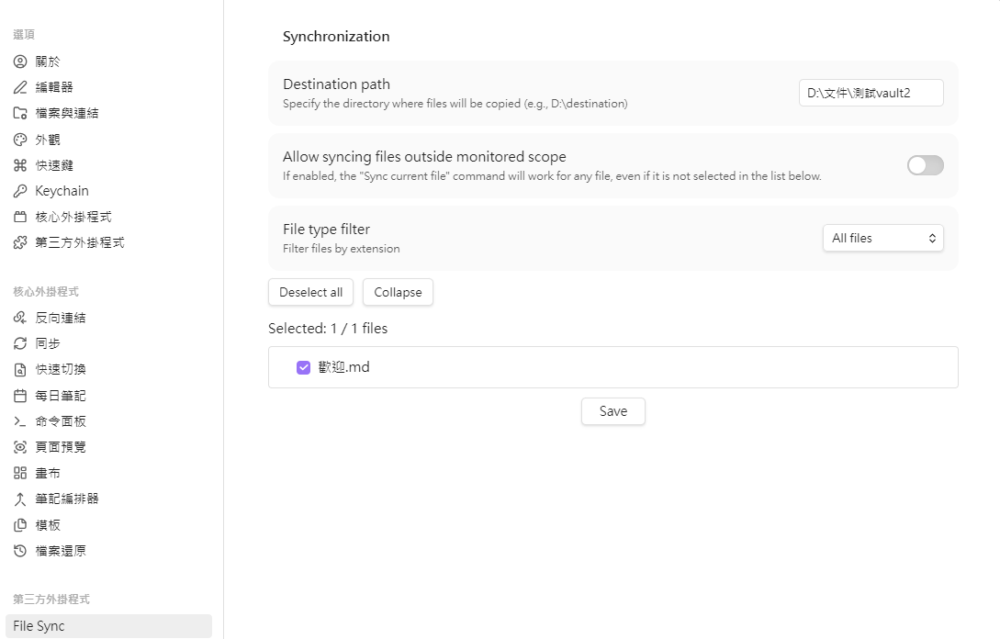

# Obsidian File Sync Plugin

> [繁體中文](README.zh-TW.md) | English

An [Obsidian](https://obsidian.md/) plugin for synchronizing selected vault files to a specified destination directory. Supports all file types, file filtering, and batch selection features.

## Features

- **Destination configuration**: Specify the target directory where files will be copied (with folder picker support)
- **File selection**: Use checkboxes to select files to sync
- **Manual save**: "Save" button to avoid re-rendering the interface on every checkbox change
- **Memory of selections**: The plugin remembers your saved file selections
- **File type filtering**: Filter by file type (.md, .png, .pdf, etc.)
- **Smart batch selection**:
  - Unified toggle button - shows "Select All" when not all selected, "Deselect All" when all selected
- **Folder management**:
  - Tree structure display - subfolders displayed below parent folders with automatic indentation
  - Collapsible/expandable folders
  - Smart toggle button - shows "Expand" or "Collapse" based on current state
  - Folder-level checkboxes - select all files in a folder (including subfolders) with one click
  - Supports indeterminate state (when some files are selected)
- **Scroll position preservation**: Automatically restores scroll position when re-rendering, won't jump back to top
- **Structure preservation**: Maintains original folder structure during sync
- **All file types supported**: .md, .png, .jpg, .pdf, .txt, .docx, .xlsx, etc.
- **Smart incremental sync**: Only syncs files that have been modified since the last sync
- **Sync current file**: Command to instantly sync the currently active file
- **Flexible scope control**: Option to allow syncing individual files even if not in the monitored list
- **Error logging**: Sync errors are logged to `sync-errors.log` file in the plugin folder

## Installation

### Method 1: Manual Installation (Development Version)

1. Find the `.obsidian/plugins/` folder in your vault
2. Create a folder named `file-sync-plugin`
3. Copy the following files to that folder:
   - `main.js`
   - `manifest.json`
   - `styles.css`
4. Restart Obsidian
5. Go to **Settings → Community plugins** → Make sure "Safe mode" is disabled
6. Enable "File Sync Plugin" in the "Installed plugins" list

### Method 2: Build from Source

```bash
# Navigate to the plugin directory
cd obsidian-file-sync-plugin

# Install dependencies
npm install

# Build the plugin
npm run build

# The compiled main.js will be generated in the root directory
```

Alternatively, install the plugin by downloading it from the [Release Tab](https://github.com/HXuanHui/obsidian-file-sync-plugin/releases).

## Usage

### 1. Configure Destination Path

1. Open **Settings → File Sync Plugin**
2. Enter the target directory path in "Destination Path", or click the "Browse" button to select a folder
   - Examples: `D:\Documents\destination` or `C:\Backup\notes`

### 2. Select Files to Sync

1. Use the "File Type Filter" dropdown to filter by file type
   - Options: All Files, .md, .png, .jpg, .pdf, .txt
2. Folder operations:
   - Files are displayed in a tree structure, with subfolders indented below parent folders
   - Click the arrow icon (▶/▼) next to folder names to collapse/expand individual folders
   - Use the smart toggle button to quickly manage all folders:
     - Shows "Collapse" when most folders are expanded
     - Shows "Expand" when most folders are collapsed
   - Check the checkbox next to a folder to select all files in that folder and all subfolders
   - Folder checkboxes support three states:
     - Checked: All files are selected
     - Unchecked: No files are selected
     - Indeterminate: Some files are selected
3. Use checkboxes to select individual files
4. Or use the smart batch selection button:
   - Shows "Select All" when not all files are selected - selects all files matching the filter
   - Shows "Deselect All" when all files are selected - clears all selections
5. **Click the "Save" button at the bottom of the screen to save your selections**
   - The button will be highlighted when there are unsaved changes
   - File count will show "(unsaved changes)" indicator
   - Scroll position will be automatically preserved when re-rendering, won't jump back to top

### 3. Execute Sync

Click the Sync icon in the left sidebar to execute the sync.

The plugin will:
- Verify that the destination path exists
- Check modification times of selected files (Smart Sync)
- Copy only files that have changed since the last sync
- Maintain the original folder structure
- Display sync progress and result notifications
- Log any errors to the `sync-errors.log` file

### 4. Sync Current File

1. Open a file in Obsidian
2. Run the command palette (Ctrl/Cmd + P)
3. Type `Sync current file` and press Enter
4. The current file will be synced to the destination

**Note:** By default, this command only works for files that are in your "Monitored Scope" (selected in settings).
To allow syncing any file, enable **"Allow syncing files outside monitored scope"** in the plugin settings.

## Error Logging

Errors during the sync process are logged to the `sync-errors.log` file in the plugin folder, located at:
```
<your vault>/.obsidian/plugins/file-sync-plugin/sync-errors.log
```

Each sync appends a timestamp and error details.

## Notes

- This plugin only supports desktop Obsidian (requires file system access)
- Ensure the destination path has sufficient storage space
- Sync will overwrite files with the same name at the destination
- Supports file names and paths containing Chinese characters
- Remember to click the "Save" button to save file selections, otherwise sync won't execute

## Technical Details

- **Development Language**: TypeScript
- **Build Tool**: esbuild
- **Minimum Obsidian Version**: 0.15.0
- **Author**: HXuanHui

## Development

```bash
# Development mode (auto recompile)
npm run dev

# Build production version
npm run build

# Lint check
npm run lint
```

## License

This plugin is based on the Obsidian Sample Plugin.

## Reporting Issues

If you encounter any issues or have suggestions, please create an Issue on GitHub.

## Screenshots



## Changelog

### v1.1.0
- **Smart Sync**: Added incremental sync support. Only files modified since the last sync will be copied.
- **New Command**: Added "Sync current file" command to sync the active file immediately.
- **Scope Control**: Added setting "Allow syncing files outside monitored scope" to control `Sync current file` behavior.
- **Performance**: Optimized file modification checks using direct file system stats (`adapter.stat`) to catch external edits.

### v1.0.0
- Initial release
- File filtering and batch selection support
- Tree structure display for folder hierarchy
- Collapsible folders with folder-level selection (including subfolders)
- Smart toggle buttons (Select All/Deselect All, Expand/Collapse)
- Save button at the bottom of the screen
- Manual save mode to avoid interface flickering
- Scroll position preservation feature
- Error logging feature
